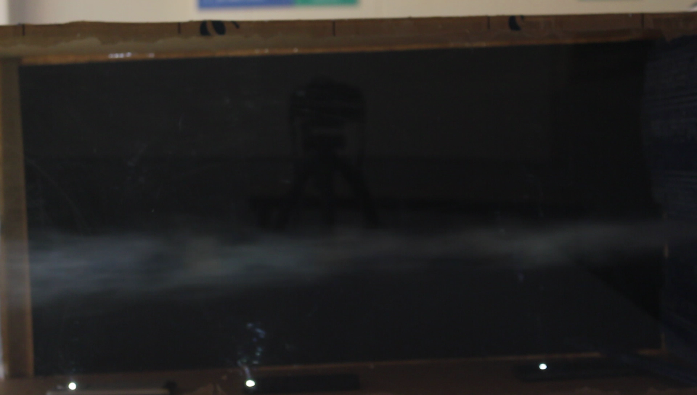
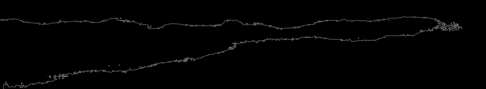

# Smoke-Flow-Analysis

This is a simple implementation of Image processing for detecting the edges of smoke flow inside a tunnel.
Aim was to create a smooth enough flow to analyze flapping flight analysis of birds. 
Part of a final undergrad project and further used for analyzing flapping flight anaylsis of birds. 
Necessary dependencies: 
1. numpy
2. cv2
3. matplotlib

